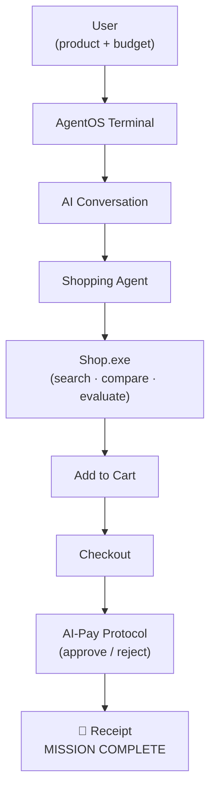

<div align="center">

<pre>

   ██████╗  ██╗ ███████╗ ████████╗     ███╗   ███╗ █████╗ ██████╗ ████████╗
   ██╔══██╗ ██║ ██╔════╝ ╚══██╔══╝     ████╗ ████║██╔══██╗██╔══██╗╚══██╔══╝
   ██████╔╝ ██║ █████╗      ██║        ██╔████╔██║███████║██████╔╝   ██║   
   ██╔══██╗ ██║ ██╔══╝      ██║        ██║╚██╔╝██║██╔══██║██╔══██╗   ██║   
   ██║  ██║ ██║ ██║         ██║        ██║ ╚═╝ ██║██║  ██║██║  ██║   ██║   
   ╚═╝  ╚═╝ ╚═╝ ╚═╝         ╚═╝        ╚═╝     ╚═╝╚═╝  ╚═╝╚═╝  ╚═╝   ╚═╝   

</pre>

### The future of shopping is autonomous.

**RiftMart** is an AI-native e-commerce experience built for autonomous agents, not human shoppers -
wrapped in a retro Y2K / Windows-XP-era terminal that makes the AI's shopping mission feel like
you're hacking into a futuristic OS.

[](https://rift-mart.vercel.app)
[](./LICENSE)
[](#-team)

[](#-tech-stack)
[](#-tech-stack)
[](#-tech-stack)
[](#-tech-stack)
[](#-tech-stack)

[Live Demo](https://rift-mart.vercel.app) · [Features](#-features) · [How It Works](#-how-it-works) · [Getting Started](#-getting-started) · [Team](#-team)

</div>

---

## 📖 Overview

Traditional e-commerce is built for humans clicking through pages. **RiftMart flips that** - it's a
shopping platform designed for an AI agent to operate end-to-end. You give it two things, a
**product** and a **budget**, and the agent takes it from there: searching, comparing prices,
reading reviews, picking a winner, checking out, and paying - while you watch the entire mission
play out inside a terminal that looks like it booted off a 2004 BIOS chip.

No dashboards. No product grids. Just a black screen, a blinking cursor, and an AI doing your
shopping for you.

---

## ✨ Features

- 🤖 **Autonomous AI shopping agent** - takes a product + budget and runs the whole mission unattended
- 🖥️ **AgentOS Terminal** - a fully custom, from-scratch terminal UI (no `cmd.exe`/xterm dependency)
- 💾 **BIOS-style boot sequence** - memory check, kernel load, driver init, animated progress bar
- 💬 **Conversational AI intake** - natural back-and-forth to capture what to buy and how much to spend
- 🔍 **Simulated multi-source search** - Flipkart / Amazon comparison, price comparison, review checks
- 🛒 **Shop.exe** - the actual product catalog, search, and checkout flow the agent drives
- 💰 **AI-Pay Protocol** - a mock payment rail with rule-based approval and transaction records
- 🧾 **ASCII receipt** - a printable, copyable transaction summary at the end of every mission
- 🎨 **Y2K / retro-CRT aesthetic** - scanlines, CRT flicker, glow text, and a fully custom color system
- ⚡ **Modular architecture** - terminal, shop, agent, and payment are independent services with clean interfaces between them

---

## 🧭 How It Works

The user only ever provides **two inputs** - everything else is autonomous.



### The terminal experience, phase by phase

| # | Phase | What happens |
|---|-------|--------------|
| 1 | **Boot Screen** | RIFT BIOS boots up - memory check, kernel + driver loading, progress bar to 100% |
| 2 | **ASCII Logo** | The RIFT MART wordmark glitches in and settles into a steady CRT glow |
| 3 | **Terminal** | A live `RIFT>` command line - real keyboard input, command history, built-in commands (`help`, `buy`, `clear`, `about`...) |
| 4 | **AI Conversation** | The agent asks what to buy and what your budget is, then runs a simulated multi-source search |
| 5 | **Shop.exe Launch** | Control hands off to the shopping engine, which searches, compares, and evaluates products |
| 6 | **Purchase Complete** | The agent reports back the product it picked, the price, and the seller |
| 7 | **Receipt** | An ASCII transaction receipt - savable, copyable |
| 8 | **Shutdown** | Session teardown, memory cleared, power off |

No manual clicking required after the mission starts - the agent drives the entire flow from
search to payment.

---

## 🏗️ Architecture

RiftMart is divided into four independent modules connected through shared
contracts (JSON schemas + event names). Each module can be developed,
tested, and deployed independently.


```text
┌─────────────────────────┐
│     AgentOS Terminal    │
│     (frontend/)         │
│                         │
│ • User interface        │
│ • Terminal experience   │
└────────────┬────────────┘
             │
             ▼
┌─────────────────────────┐
│    Shopping Agent       │
│      (agent/)           │
│                         │
│ • Automation            │
│ • Decision logic        │
└────────────┬────────────┘
             │
             ▼
┌─────────────────────────┐
│       Shop.exe          │
│ (frontend/shop +        │
│      backend/)          │
│                         │
│ • Product catalog       │
│ • Search engine         │
└────────────┬────────────┘
             │
             ▼
┌─────────────────────────┐
│    AI-Pay Protocol      │
│      (payment/)         │
│                         │
│ • Payment rules         │
│ • Mock transactions     │
└─────────────────────────┘
```

- **Terminal owns the experience** - everything a judge/user sees first: boot, logo, command line, conversation, receipt
- **Agent owns the decisions** - what to search for, what counts as "best," when to check out
- **Shop.exe owns the catalog** - product data, search, filtering, the checkout surface
- **AI-Pay owns money** - budget validation, approval/rejection, transaction IDs

---

## 💻 Tech Stack

| Layer | Technology |
|-------|-----------|
| **Frontend** | React, Vite, custom CSS (CRT/scanline effects, glow animations) |
| **Backend** | FastAPI, Python |
| **AI Agent** | Autonomous decision logic, browser automation, product evaluation |
| **Database** | SQLite |
| **Deployment** | Vercel (frontend) |

---

## 📂 Project Structure

```
Rift-Mart/
├── frontend/                  # AgentOS Terminal - the experience layer
│   ├── public/
│   ├── src/
│   │   ├── assets/
│   │   ├── components/
│   │   │   ├── BootScreen.jsx     # Phase 1 - BIOS boot sequence
│   │   │   ├── AsciiLogo.jsx      # Phase 2 - logo reveal
│   │   │   ├── Terminal.jsx       # Phase 3 - command line
│   │   │   ├── Conversation.jsx   # Phase 4 - AI intake + search animation
│   │   │   └── Shop/
│   │   │       └── ShopExe.jsx    # Phase 5+ - shopping UI
│   │   ├── App.jsx                # Phase orchestrator / state machine
│   │   ├── main.jsx
│   │   └── index.css
│   ├── index.html
│   ├── package.json
│   └── vite.config.js
│
├── backend/                   # FastAPI service - product + search API
├── agent/                     # Autonomous shopping agent logic
├── payment/                   # AI-Pay Protocol - mock payment rail
│
├── LICENSE
└── README.md
```

---

## 🚀 Getting Started

### Prerequisites

- **Node.js** 18+ and npm
- **Python** 3.10+
- **Git**

### Clone the repo

```bash
git clone https://github.com/shashwat230710/Rift-Mart.git
cd Rift-Mart
```

### 1. Frontend (AgentOS Terminal)

```bash
cd frontend
npm install
npm run dev
```

Runs at `http://localhost:5173` by default.

### 2. Backend (Shop.exe API)

```bash
cd backend
pip install -r requirements.txt --break-system-packages
uvicorn main:app --reload
```

> Adjust the module name in the `uvicorn` command if your entrypoint file isn't `main.py`.

### 3. Agent

```bash
cd agent
pip install -r requirements.txt --break-system-packages
python agent.py
```

The agent is designed to run locally alongside the frontend/backend - it isn't meant to be hosted.

### 4. Payment (AI-Pay Protocol)

```bash
cd payment
pip install -r requirements.txt --break-system-packages
uvicorn main:app --reload --port 8001
```

Once all four are running, open the frontend URL and start a mission from the terminal
(`buy <product>` once you're past the boot/logo screens).

---

## 🎮 Usage

1. Wait for (or skip past) the BIOS boot sequence and logo
2. At the `RIFT>` prompt, type `help` to see available commands
3. Type `buy <product name>` - e.g. `buy gaming mouse`
4. Answer the AI's budget question
5. Watch the agent search, compare, and check out automatically
6. Read your ASCII receipt at the end - `MISSION COMPLETE`

---

## 🎨 Theme

RiftMart deliberately avoids looking like a normal website. The whole interface is built around:

- CRT scanlines, screen flicker, and vignette
- A DOS/BIOS-inspired boot sequence rather than a login page
- Glitch-in text reveals and blinking block cursors instead of fades
- A constrained retro color palette (green, amber, white, error red, and a touch of blue)

The goal: **don't build a fake operating system - build the illusion of one.**

---

## 🔮 Roadmap

- [ ] Multi-store product search
- [ ] Real (non-simulated) browser automation for checkout
- [ ] AI negotiation engine for price haggling
- [ ] Delivery tracking integration
- [ ] Voice-controlled shopping missions
- [ ] Multi-agent collaboration (one agent per store)
- [ ] Real-time price monitoring & alerts

---

## 👥 Team

RiftMart was built as a hackathon project across five independent modules:

| Module | Team Member | GitHub | LinkedIn | Responsibilities |
|--------|-------------|--------|----------|------------------|
| 🖥️ RiftOS Terminal | **Mobashshir** | [](https://github.com/Mobasheera) | [](https://linkedin.com/in/mobashshir-ahsan/) | React frontend, `App.jsx`, `Terminal.jsx`, `Conversation.jsx`, boot sequence, ASCII logo, animations, Y2K theme & styling |
| 🛒 Shop.exe | **Shashwat** | [](https://github.com/shashwat230710) | [](https://linkedin.com/in/shashwat-shukla23/) | Product catalog, search, checkout flow, shopping agent automation |
| 💳 AI-Pay Protocol | **Akshata** | [](https://github.com/akshatabasankar) | [](https://linkedin.com/in/akshata-basankar/) | Initial implementation of Payment API, payment rules & mock transactions |
| 🧠 AI & Infrastructure | **Avnish** | [](https://github.com/calsify) | [](https://linkedin.com/in/avanish-mishra-0ff1c1al/) | LLM integration, backend improvements, module integration, testing, documentation & polish |
| ☁️ Deployment | **Shashwat** | [](https://github.com/shashwat230710) | [](https://linkedin.com/in/shashwat-shukla23/) | Vercel deployment, production hosting and release setup |

---

## 📜 License

This project is licensed under the [MIT License](./LICENSE) - free to use for educational,
research, and hackathon purposes.

---

<div align="center">

**RiftMart** - because the future of shopping doesn't need a mouse.

</div>
